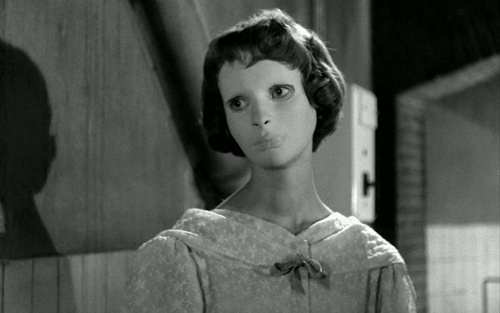

# Dead Skin Mask

## Points 100

Mascoutah Police Department received an anonymous fax yesterday regarding a domestic altercation that happened in 1960. Merle H. Sweeney was slain in his sleep after a drunken altercation between he and his wife. His wife claimed she had left the house and was staying with her mother in Cahokia at the time, at that time, her mother corroborated her story.

The fax that was received claimed that the wife was actually guilty and also contained a picture of the assailant. There is something strange about the picture… maybe you can help us to figure it out.

https://goo.gl/S6GuKv

https://hacktober.nyc3.digitaloceanspaces.com/RWLdUXz4zo4s1TdchGsnU7OwjLRI6okP.jpg

Local Copy of Files:

## Answer