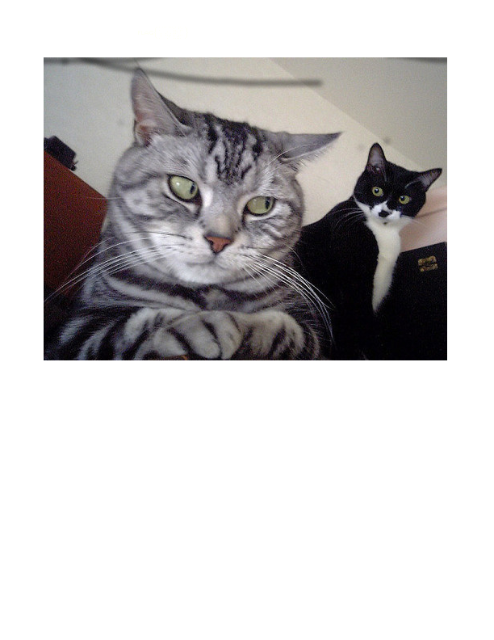

# Information Leak

## Points 100

This scanned document was recovered from the files of a former employee of the National Silly Association. We need to figure out the serial number of the printer it was originally printed from so we can locate the facility. Forwards or backwards, it doesn't matter.

Flag will be in the format of ######## without a preceding "flag-"

https://goo.gl/gwSSQp

https://hacktober.nyc3.digitaloceanspaces.com/suspicion.png

Local Copy of File:

## Answer